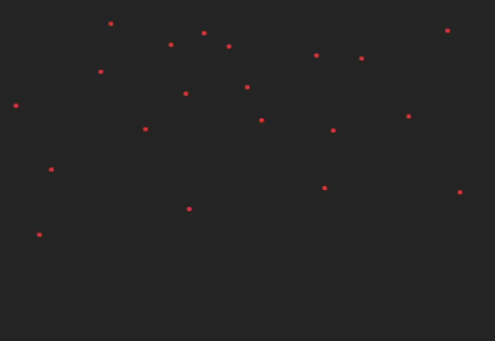

# Click_points

Este projeto cria um ponto na tela quando um local é tocado.

## Descrição

O repositório `Click_points` é uma implementação que adiciona um ponto na tela ao ser tocada. Esta ideia foi inspirada por uma aula do canal Front Beginners no YouTube. O objetivo é demonstrar como criar uma interação simples baseada em eventos de toque.

## Tecnologias Utilizadas

- **React**: Biblioteca para construir interfaces de usuário.
- **TypeScript**: Linguagem que adiciona tipagem estática ao JavaScript, ajudando a evitar erros e melhorar a manutenção do código.

## Referência

A ideia para este projeto foi baseada na seguinte video-aula do canal Front Beginners:

[Assistir Aula](https://www.youtube.com/watch?v=dOsBtM2U018&t=1871s)

Agradecemos ao canal Front Beginners pela excelente video-aula e inspiração.

## Imagem



## Como Usar

1. Clone o repositório:

   ```bash
   git clone https://github.com/SEU_USUARIO/Click_points.git

   ```

2. Navegue até o diretório do projeto:

   ```bash
   cd Click_points

   ```

3. Abra o projeto no seu editor de código preferido e execute-o conforme as instruções específicas do projeto
   ```bash
   (ex.: npm start, yarn start, etc.).
   ```
